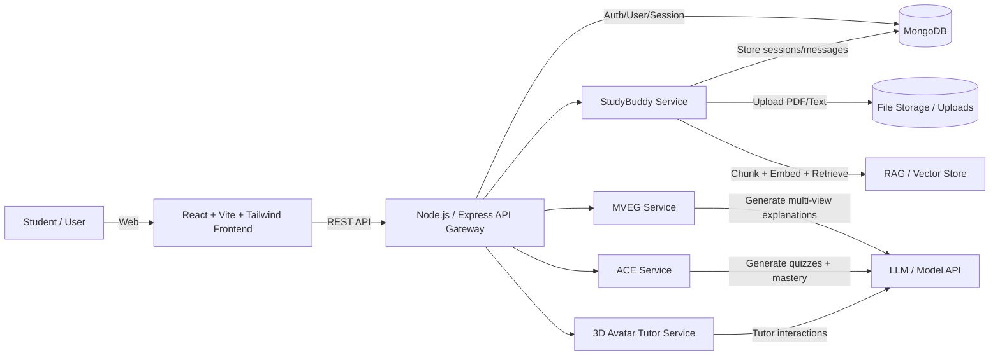

# EduMentor – AI-Powered Personalized Learning Platform (Final Year Project)

EduMentor is a GenAI-based web platform designed to provide personalized academic support for university students.  
It combines four connected learning modules in one unified system:

- **StudyBuddy Agent** – session-based chat assistant with lecture-note uploads (PDF/Text) and context-aware responses  
- **Multi-View Explanation Generator (MVEG)** – generates explanations in multiple styles (Simple / Analogy / Code / Visual)  
- **3D Avatar Tutor** – futuristic tutor interface to improve engagement (voice/visual tutor experience)  
- **Adaptive Reinforcement Engine (ACE)** – generates adaptive quizzes/flashcards and tracks mastery/weak areas for retention

---

## Team & Roles

| Member | Component / Responsibility |
|-------|-----------------------------|
| **[Arunod K. H. G. T]** | Common UI + integration + StudyBuddy Agent |
| **[Denuwan A. S.]** | Multi-View Explanation Generator (MVEG) |
| **[Nimesha M. G. S]** | 3D Avatar Tutor |
| **[Nawarathna N. D. S.]** | Adaptive Reinforcement Engine (ACE) |

---

## Problem Statement

Many students struggle with university-level content because most tools:
- provide only one style of explanation,
- do not align answers with lecture notes/syllabus,
- do not track weak areas for retention,
- and are not designed as a complete learning workflow.

EduMentor solves this by offering a unified system that supports:
**understanding → multi-view explanation → guided tutoring → reinforcement practice**.

---

## Key Features

### Common Platform (All Modules)
- Futuristic responsive UI (React + Tailwind)
- Light/Dark mode
- Unified navigation for all modules

### StudyBuddy Agent
- Chat sessions per lesson/topic (no mixing)
- Upload **PDF notes** or **text notes** per session
- Context-aware answers (RAG-ready flow)
- Chat history saved per session

### Multi-View Explanation Generator (MVEG)
- Explanations in multiple views: Simple / Analogy / Code / Visual
- Strict syllabus mode using lecture content

### 3D Avatar Tutor
- Avatar-based teaching interface
- Supports interactive learning experience (future-ready design)

### ACE Reinforcement Engine
- Adaptive quizzes/flashcards
- Weak area tracking and mastery improvement

---

## System Architecture

### High-Level Architecture (MERN + Services)

## Tech Stack

### Frontend
- **React (Vite)**
- **Tailwind CSS**
- **React Router**

### Backend
- **Node.js + Express**
- **MongoDB (Mongoose)**
- **REST APIs**

### AI / GenAI Layer (Planned / In Progress)
- **RAG pipeline** for lecture-note based answering  
- **Embeddings + Vector Search** for retrieval  
- **LLM** for response generation  

## Project Dependencies

### Frontend Dependencies (Typical)
- `react`, `react-dom`
- `react-router-dom`
- `tailwindcss`, `postcss`, `autoprefixer`

### Backend Dependencies (Typical)
- `express`
- `mongoose`
- `cors`
- `dotenv`
- `multer` *(PDF uploads)*
- `axios` *(service calls if needed)*

### AI / RAG Dependencies (If used)
- `langchain` *(or custom pipeline)*
- `pdf-parse` / `pypdf` *(depending on implementation)*
- Embeddings library + Vector DB *(FAISS / Pinecone / Chroma, etc.)*
